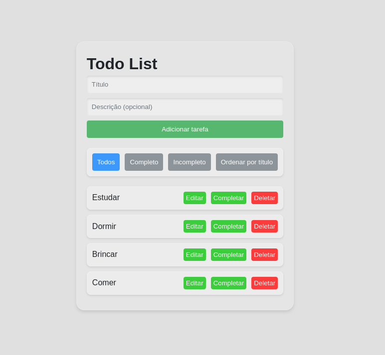

<div align="center">

</div>

<div align="right">

#### - Projeto finalizado 🟢

</div>
<div align="center">

# Scale | Todo List

</div>


### <div align="center"> Aplicação em Reactjs/Typescript, abordando conceitos sobre: </div>

- [TypeScript](https://www.typescriptlang.org/) - Tipagens
- [Reactjs](https://pt-br.reactjs.org/) - Uso de estados
- [Localstorage](https://developer.mozilla.org/pt-BR/docs/Web/API/Window/localStorage) - Armazenamento de dados do carrinho
- [Styled component](https://styled-components.com/) - Componentes personalizados

## <div align="center">Requisitos</div>

Para executar a aplicação é necessário instalar algumas ferramentas tais como um editor de códigos para realizar compilação dos mesmos. Nesse projeto foi utilizado o [Visual Studio Code](https://code.visualstudio.com/), [NodeJS](https://nodejs.org/en/) para compilação do código, [git](https://git-scm.com/downloads) para baixar o repositório e baixar todas as dependências necessárias.

```bash
# Clone este repositório(caso ja tenha feito isso no passo anterior, pule para o próximo comando)
$ git clone <https://github.com/Ricnaga/scale-todo-list>

# Acesse a pasta do projeto no terminal
$ cd scale-todo-list

# Instale as dependências
$ yarn (ou npm install)

# Inicie a aplicação
$ yarn dev (ou npm run dev)

# A aplicação abrirá automaticamente um navegador com o endereço <http://localhost:5173>

# Para executar os testes digite
$ yarn test (ou npm run test)
```

#
